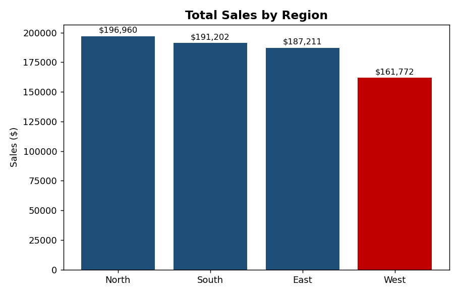
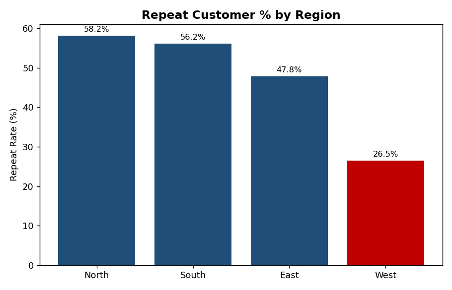
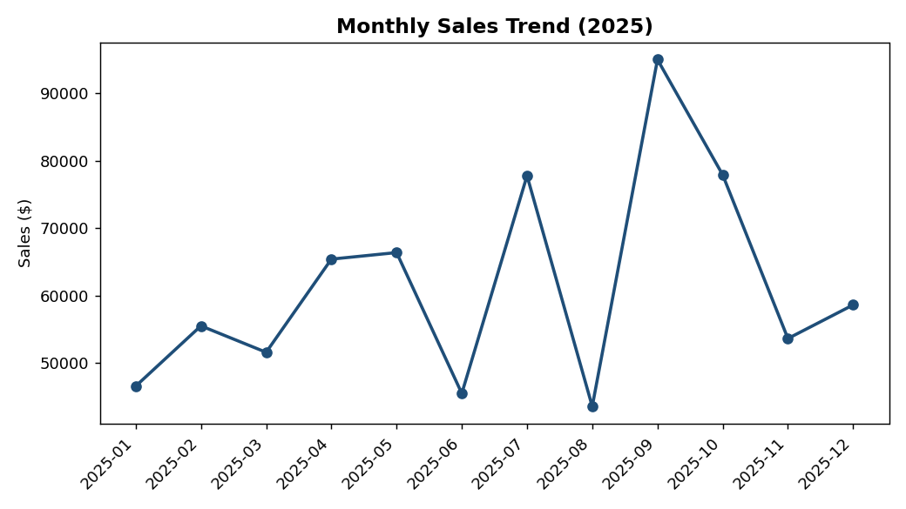

# Sales Performance Analysis

An Excel-based business analysis project examining regional sales performance, category profitability, and monthly trends for a retail business — with findings and recommendations aimed at improving underperforming regions.

## Business Question
Which regions and categories are driving (or dragging down) overall sales performance, and what should the business do about it?

## Tools Used
- Microsoft Excel (SUMIFS, COUNTIFS, SUMPRODUCT formulas, Excel Tables, native charts)
- Dataset: 650 simulated retail orders across 4 regions, 3 categories, and 12 months (2025)

## Project Structure
```
├── raw_data.csv                         # Original order-level dataset
├── Sales_Performance_Analysis.xlsx      # Full analysis workbook
├── screenshots/                         # Visuals for quick preview
└── README.md
```

The workbook contains 5 sheets:
1. **Raw Data** — cleaned, tabular order-level data
2. **Region Summary** — total sales, profit, order count, and repeat-customer rate by region, with charts
3. **Monthly Trend** — sales and profit trend across 2025, with line chart
4. **Category Summary** — sales, profit, and margin by product category
5. **Key Findings** — plain-language findings and business recommendations

## Key Findings

**1. The West region has the highest order volume but the lowest total sales and by far the lowest repeat-customer rate (~26%, vs 48–58% in other regions).**
→ *Recommendation:* Launch a retention campaign in the West (second-purchase discount, follow-up outreach) to close the repeat-rate gap with other regions.

**2. Technology has the highest average order value but a comparatively lower profit margin, likely driven by heavier discounting.**
→ *Recommendation:* Review discount thresholds on Technology orders — tightening them slightly could improve margin without materially hurting volume.

**3. Monthly sales fluctuate rather than trend steadily, suggesting seasonality or inconsistent demand generation.**
→ *Recommendation:* Map high/low months against past promotions to plan inventory and staffing more precisely.

## Preview





## What This Project Demonstrates
- Cleaning and structuring raw transactional data
- Building formula-driven summaries (not hardcoded numbers) that update automatically if the source data changes
- Translating data into business findings and actionable recommendations — not just charts

---
*This is a practice project built on simulated data as part of my Business Analyst learning path.*
